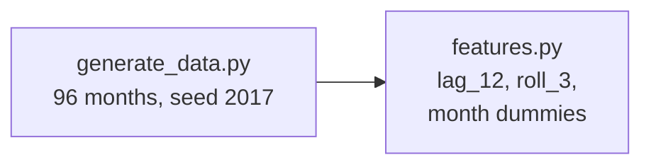
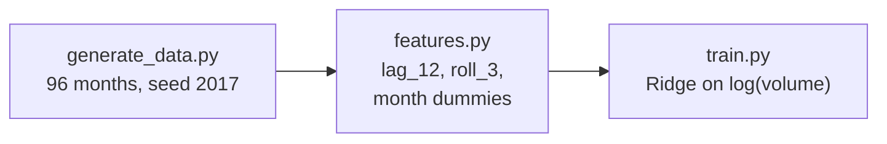
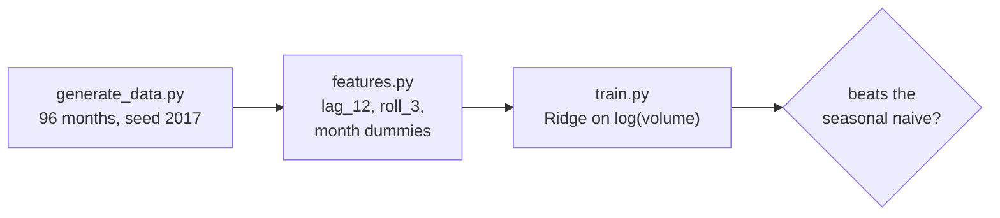
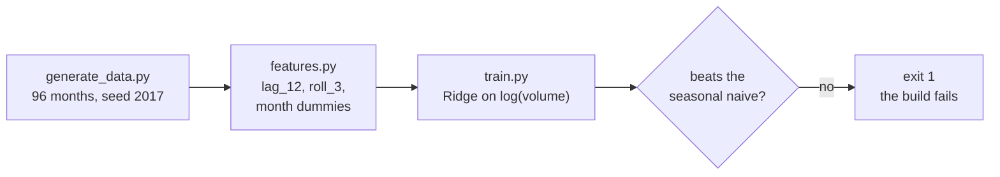
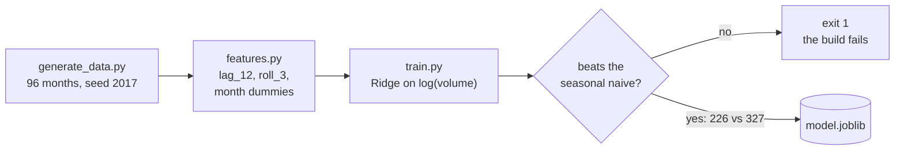
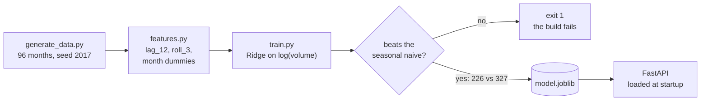
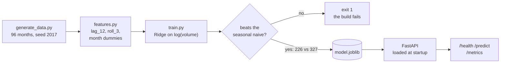
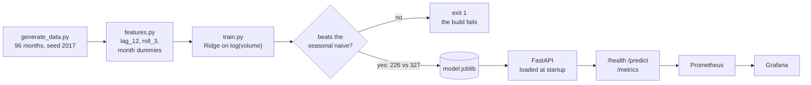
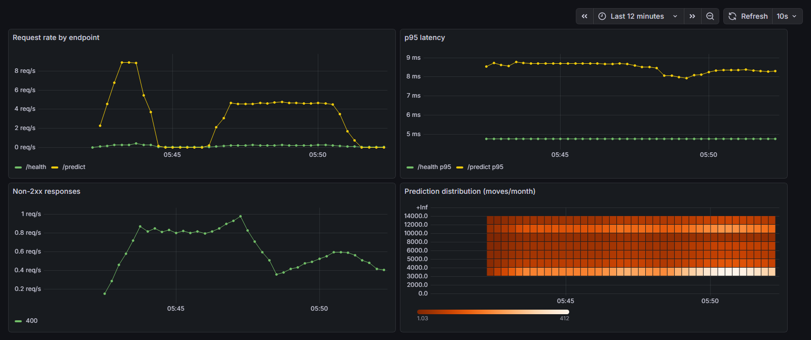

# freight-forecast

[](https://github.com/T92T1914/freight-forecast/actions/workflows/ci.yml)

Monthly shipment volume forecasting, served as a containerized API —
scikit-learn, FastAPI, Docker, Kubernetes, Prometheus and Grafana, with the
whole pipeline reproducible from one command.

I spent six years in Air Force logistics, much of it at a JPPSO moving
household goods: freight rates, storage, and the annual PCS surge. Forecasting
that demand cycle was the job, not a class exercise — every summer, roughly
40,000 moves land between May and August while winter runs at about a third of
peak, and staffing, warehouse space and carrier capacity all have to be
committed months ahead of it. This project is that problem, built properly:
a model that has to earn its place against the baseline a human planner
already uses, and then the serving, deployment and monitoring around it.

## The bar: beat "same month last year"

A planner with no model looks up last year's number for the same month. That
seasonal-naive forecast is the honest baseline, and a model that can't clear
it is not worth deploying no matter how good its architecture looks.

The first twelve months are spent filling the `lag_12` warm-up, so the model
trains on **2018-01 → 2022-12 (60 months)** and is evaluated on **2023-01 →
2024-12 (24 months), never seen during training**:

| | MAE (moves) | MAPE |
|---|---|---|
| Seasonal naive — same month last year | 327 | 4.8% |
| Ridge on log(volume) | **226** | **3.4%** |

**31% lower error than the baseline.** `src/train.py` exits non-zero if the
model ever loses to the naive predictor, so a regression fails CI rather than
shipping quietly.

Two modelling decisions worth naming:

- **The target is `log(volume)`, not volume.** Seasonality here is
  multiplicative — the summer peak scales with the overall level rather than
  adding a fixed number of moves — so the model fits in log space and
  `TransformedTargetRegressor` maps predictions back to move counts. Fitting
  raw volume asks a linear model to treat a 200-move miss in January as the
  same error as in July, which is not what a planner means by "wrong."
- **Features can only see the past.** `lag_12` (same month last year) and
  `roll_3` (previous quarter's mean) are both shifted before use, and any row
  without a full 12-month history is dropped. `build_features` also *raises*
  if the series has gaps or duplicate months, because those lags are computed
  by row position — on a series with a hole, "12 rows back" silently stops
  meaning "last year" and the model would be training on leaked information
  with no visible symptom.

## How it fits together

P1 (first 1 line(s)):


P2 (first 2 line(s)):


P3 (first 3 line(s)):


P4 (first 4 line(s)):


P5 (first 5 line(s)):


P6 (first 6 line(s)):


P7 (first 7 line(s)):


P8 (first 8 line(s)):


## What's in the box

```
src/
  generate_data.py   synthetic monthly volumes, fixed seed, PCS-shaped
  features.py        lags, rolling mean, month dummies + the contiguity guard
  train.py           trains, evaluates against the naive, saves the artifact
  serve.py           FastAPI app: /health, /predict, /metrics
tests/               33 tests: features, data, training, API, metrics, manifests
Dockerfile           trains during the build, so a broken model fails the image
k8s/                 deployment with liveness + readiness probes, service
monitoring/          Prometheus config, provisioned Grafana, dashboard JSON
data/shipments.csv   96 months (2017–2024), regenerable from seed 2017
VERIFICATION.md      what was actually run and observed, with output
```

The data is synthetic and says so. The shape is modelled on the JPPSO cycle —
peak months carry factors summing to 7.45 against a 5,200/month base, which
puts the May–August window near 38,700 moves — with a slight year-over-year
drift and 4% noise. A fixed seed makes every number on this page reproducible.

## The API

Model loads once at startup, not per request. Input is validated by pattern
(`^\d{4}-(0[1-9]|1[0-2])$`), and a month outside the forecastable range is a
4xx with a reason rather than a confident number from an extrapolated lag.

```
GET  /health   -> {"status":"ok","model_loaded":true,"trained_through":"2022-12-01",
                   "test_mae":226.2,"test_mape":0.0335}
POST /predict  {"month":"2025-01"} -> {"predicted_volume":3297,
                                       "naive_same_month_last_year":3477}
GET  /metrics  -> Prometheus exposition
```

`/health` reports the metrics the artifact was accepted on, so a deployed
instance can be asked what it actually is instead of what it was supposed to
be. `/predict` returns the naive number alongside its own, because a forecast
is only meaningful next to the thing it claims to beat.

## Monitoring



*The stack from `monitoring/docker-compose.yml`, twelve minutes of traffic
against the container. Two request bursts on `/predict`, p95 latency steady
around 8-9 ms, the `400` line showing out-of-range months being refused
rather than answered, and the prediction histogram sitting in the 3,000-14,000
moves/month band the model was trained on.*

Three Prometheus series: request count by endpoint and status, request latency,
and a histogram of predicted volumes. The last one is the interesting one —
latency and error rate tell you the service is alive, but a model can be
perfectly healthy and quietly wrong. A prediction distribution that drifts away
from its training range is the signal that the world changed, and it is visible
before anyone files a ticket.

## Running it

```bash
pip install -r requirements.txt
python -m src.train                     # regenerates data if missing, trains, evaluates
uvicorn src.serve:app --reload          # http://127.0.0.1:8000/docs

docker build -t freight-forecast .      # trains inside the build
docker run -p 8000:8000 freight-forecast

kubectl apply -f k8s/                   # deployment + service, probes wired
docker compose -f monitoring/docker-compose.yml up   # API + Prometheus + Grafana
```

CI runs lint, tests and the image build on every push.

## What this does not do

Stated because a project that only lists its wins is not worth much.

- **The 226 MAE is a point estimate on 24 observations.** The absolute errors have
  a standard deviation of 276, so the standard error on that mean is 56 and a 95%
  interval runs from roughly 116 to 336. It clears the naive baseline of 327
  comfortably and repeatedly, which is the claim being made — but "226" should not
  be read as three significant figures of accuracy.
- **The error is concentrated exactly where it matters.** Split the held-out months
  by season: peak (May-Aug) MAE is **418**, off-peak is **130**. In relative terms
  they are close (3.83% vs 3.11% MAPE) because peak volumes are roughly three times
  larger, but capacity is committed in absolute moves, so the forecast is least
  precise in the four months anyone actually plans around.
- **The data is synthetic**, and its seasonality was specified rather than
  discovered — the model is being asked to recover a pattern that was put there on
  purpose. That makes it a fair test of the pipeline and a weak test of the model.
  Real JPPSO data would bring regime changes (policy shifts, base realignments,
  a pandemic) that a 60-month linear fit has no way to anticipate.
- **Point predictions only.** Planning wants an interval, not a number — the useful
  question is "how bad is the plausible worst case for August" and this cannot
  answer it. Quantile regression or conformal prediction would be the next thing
  I built, ahead of any more accurate point model.
- **The monitoring watches, it does not act.** The prediction histogram will show
  drift, but nothing alerts on it and nothing retrains. There is no data
  versioning, so a rerun with different data would silently produce a different
  model under the same tag.

## Verification

`VERIFICATION.md` records what was executed and observed rather than intended:
identical predictions from the local run and the container, both replicas
reaching Ready behind the readiness probe on a k3d cluster, and Grafana's own
datasource returning `/predict` at 0.8 req/s with 70 observations in the
prediction histogram after a traffic burst.

MIT licensed.
