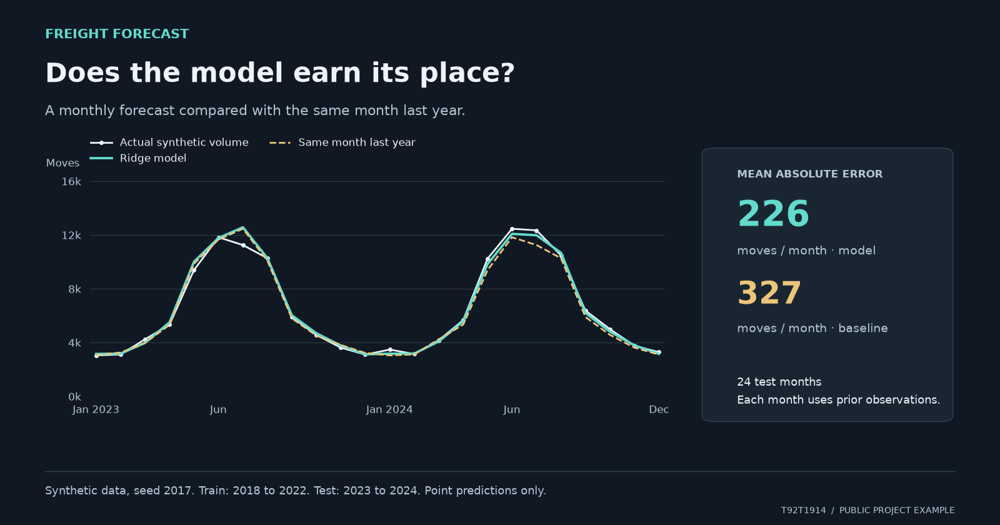

# Read the visual example



The model averages 226 moves of error per month, compared with 327 for the seasonal baseline. This is a chronological test on synthetic data, with prior observations available for each prediction.

## Reproduce the values

Run from this repository using its documented Python environment.
Evidence was checked against commit `0813d2c`.

```python
import pandas as pd
from src.features import build_features
from src.train import train

df = pd.read_csv("data/shipments.csv", parse_dates=["date"])
artifact = train(df)  # In memory; does not replace the saved serving model.
features, columns = build_features(df)
test = features.iloc[-24:]
predictions = artifact["model"].predict(test[columns])
print(artifact["metrics"])
for row, prediction in zip(test.itertuples(), predictions):
    print(row.date.date(), row.volume, prediction, row.lag_12)
```

The figure includes all 24 test months. The volume axis begins at zero. The
model is trained through December 2022. Each later prediction uses available
prior observations for its lag features; this is not a forecast of all 24
months made at once. No model or data file was overwritten to make the figure.
The existing [monitoring screenshot](grafana-dashboard.png) documents a
different question: how the local service behaved under recorded traffic.

## Inspect the source

The [underlying values](visual-example-data.json) include the source and
conditions. A [vector copy](freight-forecast-example.svg) is available for a closer look.
The figure is a visual explanation of the public implementation, not a
screenshot of an external application.
