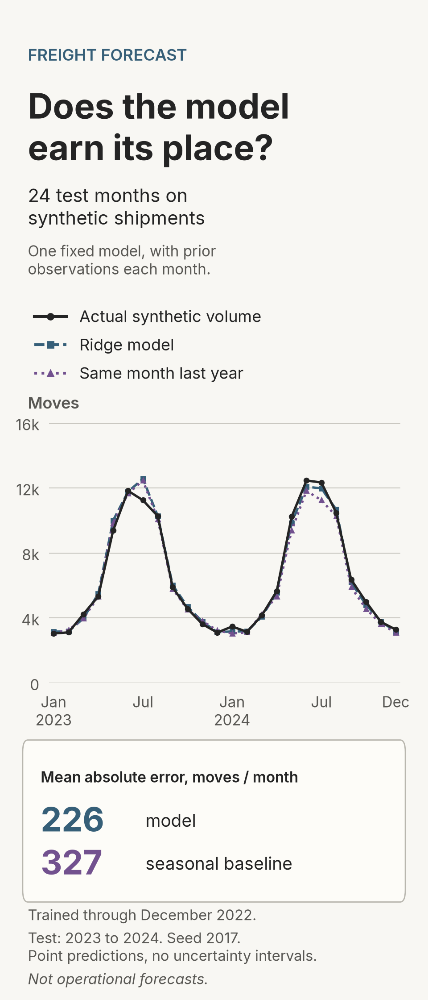

# Read the visual example

<a href="visual-example-data.json">
  <picture>
    <source media="(prefers-color-scheme: dark)" srcset="freight-forecast-obscur.png">
    <source media="(prefers-color-scheme: light)" srcset="freight-forecast-clair.png">
    
  </picture>
</a>

The model averages 226 moves of error per month, compared with 327 for the seasonal baseline. This is a chronological test on synthetic data, with prior observations available for each prediction.

## Reproduce the values

Run from this repository using its documented Python environment.
Evidence was checked against commit `0813d2c`.

```python
import pandas as pd
from src.features import build_features
from src.train import train

df = pd.read_csv("data/shipments.csv", parse_dates=["date"])
artifact = train(df)  # In memory; does not replace the saved serving model.
features, columns = build_features(df)
test = features.iloc[-24:]
predictions = artifact["model"].predict(test[columns])
print(artifact["metrics"])
for row, prediction in zip(test.itertuples(), predictions):
    print(row.date.date(), row.volume, prediction, row.lag_12)
```

The figure includes all 24 test months. The volume axis begins at zero. The
model is trained through December 2022. Each later prediction uses available
prior observations for its lag features; this is not a forecast of all 24
months made at once. No model or data file was overwritten to make the figure.
The existing [monitoring screenshot](grafana-dashboard.png) documents a
different question: how the local service behaved under recorded traffic.

## Inspect the source

The [underlying values](visual-example-data.json) include the source and
conditions. The new [Clair SVG](freight-forecast-clair.svg) and [Obscur SVG](freight-forecast-obscur.svg) use outlined Inter labels. The [original PNG](freight-forecast-example.png) and [original SVG](freight-forecast-example.svg) remain unchanged.
The figure is a visual explanation of the public implementation, not a
screenshot of an external application.

## Rebuild the figure without another experiment

The maintained renderer reads the saved values above. It does not import the
estimator, train a model, run prediction or replace the serving artifact.
Install the optional authoring dependencies and supply the six official static
Inter TTF files from the same release in a local directory:

```sh
python -m pip install -r requirements-figures.txt
python tools/render_synthetic_figure.py --font-dir /path/to/Inter/extras/ttf
python tools/render_synthetic_figure.py --check
```

No font download happens during rendering. The renderer checks each face's
PostScript name, weight, italic flag and Latin glyph coverage before drawing.
Regular, Semibold, Bold and genuine Italic supply this figure's labels. It records
all six input file hashes in [the rendering receipt](freight-forecast-figure.json).
The PNG editions rasterize those glyphs. The SVG editions outline their labels,
so neither requires a viewer to install Inter. The source JSON and the
[public table](https://t92t1914.github.io/freight-forecast/#interactive) retain
selectable values. No font files are distributed with the figure.

Both editions contain the same 72 plotted values, axis from zero to 16,000 moves,
24 months and recorded errors. Line styles and markers identify series as well
as color. The tall layout keeps the legend and error summary readable when the
figure appears inside a narrow README. This is a new presentation of the old
synthetic result, separate from the BTS index evaluation and its baseline win.

The README and these notes use GitHub's light/dark picture sources with a Clair
fallback. The public page uses its effective Auto, Clair or Obscur selection,
including an explicit choice opposite to the operating system. Print uses Clair.
The builder verifies the committed figures against their source hashes and
copies them without a font dependency or a silent rebuild.
